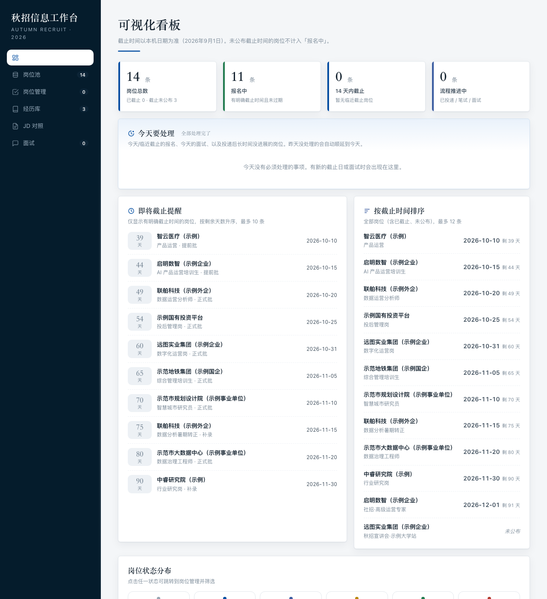
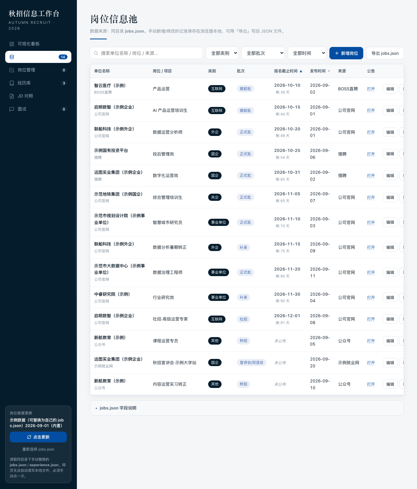

# 秋招信息工作台

> 一张为秋招求职设计的个人信息管理面板：单文件 HTML，双击即用，离线可用，数据不出本机。


## 预览



## 特性

- 📊 **可视化看板**：岗位数、待投递、截止临近等 KPI 一目了然
- 📋 **岗位池**：按类别 / 批次 / 截止时间筛选，点表头排序，状态流转，备注
- 📝 **岗位管理**：投递记录、JD 拆解、关键词提取、经历库命中、个人判定
- 📚 **经历库**：优势 / 风险追问 / 教育背景 / 工具技能 / 能力标签 / 转型叙事 / 核实修正
- 🔍 **JD 对照**：粘贴 JD 自动按行拆解，与经历库做关键词命中（仅提示，判定权在你）
- 🎤 **面试准备**：面经记录 + 基于经历库预填的优势与可能被追问点

## 快速开始

1. 下载本仓库的 `秋招信息工作台（共享版）.html`
2. 双击用浏览器打开
3. 内置 14 条示例岗位 + 3 条示例经历，立即看到完整效果

无需安装、无需联网、无需后端。Windows / macOS / Linux 通用。

## 换成自己的数据

编辑 `素材库/` 中的两个文件，再在页面内导入即可。

| 文件 | 作用 |
|------|------|
| `素材库/jobs.json` | 岗位数据 |
| `素材库/experience.json` | 经历库数据 |

字段说明见 [`素材库/填表说明.md`](素材库/填表说明.md)。

**导入方式**：

- **岗位**：点击左侧「更新数据」→ 选择你改好的 `jobs.json`
- **经历库**：进入「经历库」页面 →「导入 experience.json」→ 选择文件

页面也支持直接在界面内增删改，无需再回 JSON。

## 岗位池



## 目录结构

```
.
├── README.md                              本文件
├── SKILL.md                               WorkBuddy Skill 描述
├── 秋招信息工作台（共享版）.html             主程序（单文件，零依赖）
├── docs/
│   ├── preview-dashboard.png              看板预览
│   └── preview-pool.png                   岗位池预览
└── 素材库/
    ├── jobs.json                          岗位数据模板
    ├── experience.json                    经历库数据模板
    └── 填表说明.md                        字段说明与导入方式
```

## 数据隐私

- 所有数据仅存储在浏览器本地（localStorage 或你选择的文件），**不上传任何服务器**
- 本仓库仅做数据的**组织与呈现**，不提供任何数据采集功能
- 素材请使用你有权使用的渠道获取：本地文件、表格导出、手工录入、对方开放的导出 / 接口
- 不做登录态绕过、不做签名复刻、不做频率规避

## 技术说明

- 纯前端单文件 HTML，零依赖、零外链、零后端
- 数据内嵌于 HTML（`file://` 双击即见，无需 `fetch`）
- 状态、备注、删除等编辑操作通过 `localStorage` 持久化
- 移动端响应式（窄屏表格自动转卡片）

## 许可

仅供个人求职使用，可自由修改与再分发。
